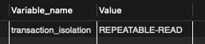
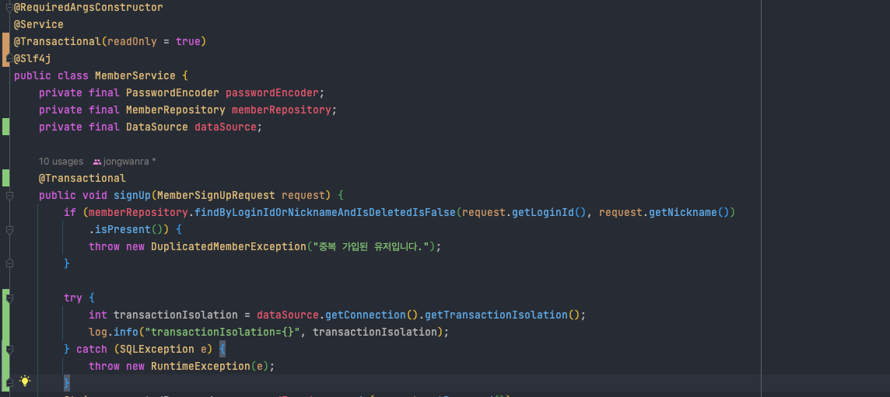

# 트랜잭션 속성

Spring Framework를 사용하여 프로젝트를 진행하다보면, `@Transactional` 어노테이션을 마주하게 된다. <br>
`@Transactional`에 대한 속성을 알아보자! 

## 트랜잭션 전파(transaction propagation)

트랜잭션 전파는 이미 진행 중인 트랜잭션이 있을 때 또는 없을 때 어떻게 동작할 것인가를 결정하는 방식을 의미한다.

A method를 실행하는 중에 B method를 호출하는 상황으로 가정하자.

### TransactionDefinition.PROPAGATION_REQUIRED

PROPAGATION_REQUIRED 옵션은 `실행 중인 트랜잭션이 존재하지 않을 경우 새로 생성하며, 존재할 경우 참여한다`. 

A method를 실행하려 했을 때 Transaction이 없기 때문에 새로 생성하며, B method를 호출할 경우에는 이미 존재하기 때문에 해당 Transaction에 참여한다.

### TransactionDefinition.PROPAGATION_REQUIRES_NEW

`항상 새로운 트랜젝션을 시작한다.`

A method를 실행했을 때 새로운 Transaction-1을 생성하고 B method를 실행했을 때 Transaction-2를 생성한다. 둘은 결국 독립적이다. 따라서 
B method가 실행해서 예외가 발생한다고 하더라도 Transaction-1에는 영향을 주지 않는다. 

### TransactionDefinition.PROPAGATION_NOT_SUPPORTED

`해당 옵션을 통해서 트랜잭션 없이 동작하도록 만들 수 있다. 진행 중인 트랜잭션이 있어도 무시한다.` 

이 옵션을 사용해서 어디에 적용할 수 있을까? <br>

생각해보면 A method에서 비즈니스 로직을 수행하는 Transaction-1을 생성했다고 하자. 로직을 마무리 하면 그 결과를 history에 저장을 하게 될 것이다.<br>
하지만 Transaction-1에 history 저장 까지 포함 시키지 않고 진행해도 무방하다고 여겨진다.


## 격리수준(isolation level)

### DEFAULT 

음.. 헷갈리는 옵션이다. 우리가 설정한 DB의 격리 수준을 따른다는 이야기도 있지만 믿기지는 않는다. MySQL의 기본 격리 수준은 REPEATABLE_READ(4)이다. <br>



직접 확인해보자.<br>

MemberService에 DataSource를 주입해서 해당 격리 수준을 체크해 봤다.



```text
2023-11-07 13:08:00:12934 | [http-nio-8080-exec-2] | INFO  | study.outfitoftheday.domain.member.service.MemberService.signUp:37 | transactionIsolation=4
```

우리가 설정한 DB의 격리수준을 따르는 것이 DEFAULT 옵션이다.


## 제한시간(timeout)

transaction을 수행하는 제한시간을 설정할 수 있다.<br>
기본 설정은 제한 시간이 없다.<br>

제한 시간은 직접 시작할 수 있는 PROPAGATION_REQUIRED 혹은 PROPAGATION_REQUIRES_NEW와 함께 사용했을 때 의미가 있다.
 
## 읽기전용(readOnly)

transaction을 설정할 때 읽기전용인지 여부를 옵션으로 설정할 수 있다. 
readOnly=true 옵션을 주면 성능향상을 기대할 수 있다. <br>

성능향상을 기대할 수 있는 이유는 JPA의 영속성 컨텍스트가 수행하는 Dirty Checking과 관련이 있다. <br>
readOnly=true로 설정하게 되면 JPA는 해당 트랜잭션 내에서 조회하는 Entity는 조회용임을 인식하고 변경 감지를 위한 Snapshot을 따로 보관하지 않는다.<br>
따라서 Snapshot을 보관하기 위한 메모리 절약과 동시에 Snapshot을 생성하는 비용이 발생하지 않는다.


## 참고 

* [@Transactional(readOnly = true)를 왜 붙여야 하나요](https://hungseong.tistory.com/74)
* 토비의 스프링 - 6.6.1 트랜잭션 정의


