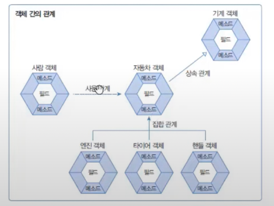
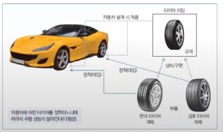

# 객체 지향 프로그래밍
#이것이자바다#

## 객체 지향 프로그래밍이란?
* 현실 세계에서 어떤 제품을 만들 때는 부품을 먼저 만들고, 이 부품들을 하나씩 조립해서 완성품을 만든다. 소프트웨어를 개발할 때에도 부품에 해당하는 객체들을 먼저 만들고, 이 객체들을 하나씩 조립해서 완성된 프로그램을 만드는 기법을 *객체 지향 프로그래밍*이라 한다. -> “이것이 자바다”

## 객체란?
* 객체(Object)란 물리적으로 존재하거나 개념적인 것 중에서 *다른 것과 식별 가능한 것*을 말한다. 예를 들어 물리적으로 존재하는 자동차
* 객체는 속성과 동작으로 구성된다. 사람은 이름, 나이 등의 속성과 웃다, 걷다 등의 동작이 있고, 자동차는 색상, 모델명 등의 속성과 달린다, 멈춘다 등의 동작이 있다. 자바는 이러한 속성과 동작을 각각 필드와 메소드라고 불린다.

## 객체의 상호작용
* 현실 세계에서 일어나는 모든 현상은 객체와 객체 간의 상호작용으로 이루어져 있다. 예를 들어 사람은 전자계산기의 기능을 이용하고, 전자계산기는 계산 결과를 사람에게 리턴하는 상호작용을 한다.
* 객체 지향 프로그램에서도 객체들은 다른 객체와 서로 상호작용하면서 동작한다. *객체들 사이의 상호작용 수단은 메소드이다.* 객체가 다른 객체의 기능을 이용할 때 이 메소드를 호출한다.

## 객체 간의 관계
객체는 단독으로 존재할 수 있지만 대부분 다른 객체와 관계를 맺고 있다. 관계의 종류에는 집합 관계, 사용 관계, 상속 관계가 있다.

## 객체 지향 프로그래밍의 특징
*캡슐화, 상속, 다형성*

* 캡슐화
    * 객체의 데이터(필드), 동작(메소드)을 하나로 묶고 실제 구현 내용을 외부에 감추는 것을 말함.
    * 외부 객체는 객체 내부의 구조를 알지 못하며 객체가 노출해서 제공하는 필드와 메소드만 이용할 수 있다.
    * 필드와 메소드를 캡슐화하여 보호하는 이유는 외부의 잘못된 사용으로 인해 객체가 손상되지 않도록 하는 데 있다. 자바 언어는 캡슐화된 멤버를 노출시킬 것인지 숨길 것인지를 결정하기 위해 *접근 제한자(Access Modifier)*를 사용한다.

* 상속
    * 객체 지향 프로그래밍에서는 부모 역할의 상위 객체와 자식 역할의 하위 객체가 있다. 부모 객체는 자기가 가지고 있는 필드와 메소드를 자식 객체에게 물려주어 자식 객체가 사용할 수 있도록 하고 이것을 상속이라고 한다.

* 다형성(Polymorphism)
    * 다형성이란 사용 방법은 동일하지만 실행 결과가 다양하게 나오는 성질을 말한다.
    * 자동차의 부품을 교환하면 성능이 다르게 나오듯이 프로그램을 구성하는 객체를 바꾸면 프로그램의 실행 성능이 다르게 나올 수 있다.

* 다형성을 구현하기 위해서는 자동 타입 변환과 재정의 기술이 필요하다. 이 기술들은 상속과 인터페이스 구현을 통해 얻어진다.

## Reference 
* 이것이 자바다

