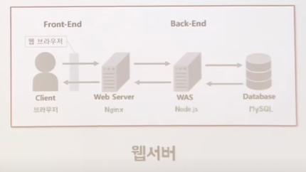
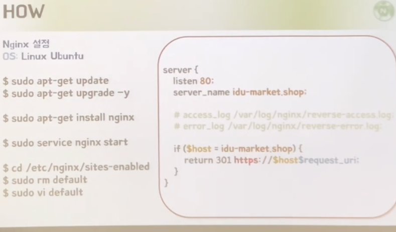

## Nginx란?(What)

- Web Server: 단순히 정적 파일을 응답
- WAS(Web Application Server): 클라이언트 요청에 대해 동적인 처리가 이뤄진 후 응답

## Nginx를 왜 사용해야 할까?

- WAS(Web Application Server)의 부담을 줄여주기 위해
  - WAS는 해야할 처리가 굉장히 많다. 그런걸 전부 다 해주기에는 무리가 있다.

## 왜 굳이 Nginx를 사용해야 할까?

- 굉장히 빠르다
- 리버스 프록시로 사용 가능하다 (Reverse Proxy)
  - 사전적 정의: '대리' / 리버스 프록시는 인터넷과 서버 사이에 있는 것 / 포워드 프록시는 클라이언트와 인터넷 사이에 있는 것을 의미
- 캐싱: 동일한 요청이 들어왔을 때 중간에서 바로 응답을 줌. / 암호화 기능
- SSL을 지원: 우리 사이트는 보안처리가 잘 되어있다는 인증서(Https 역시 Nginx를 사용한다면 쉽게 설정할 수 있다.)
- 웹페이지 접근 인증
- 압축
- 비동기 처리

> "Nginx를 Proxy 서버로 앞단에 두고 Node.js를 뒷단에 둔다면 **버퍼 오버플로우** 취약점에 의한 공격을 방지할 수 있어요." - Node.js창시자, 라이언 달 -

## How

## Reference

- [Nginx(1/2) 도대체 뭐길래 카카오, 네이버에서 사용할까](https://www.youtube.com/watch?v=ZJpT-Wa-pZ8&t=326s)

- [[Nginx] (2/2) 도대체 뭐길래 카카오, 네이버에서 사용할까](https://www.youtube.com/watch?v=tqZfdffaaBo)
