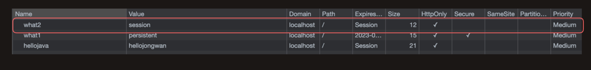
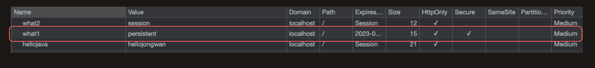
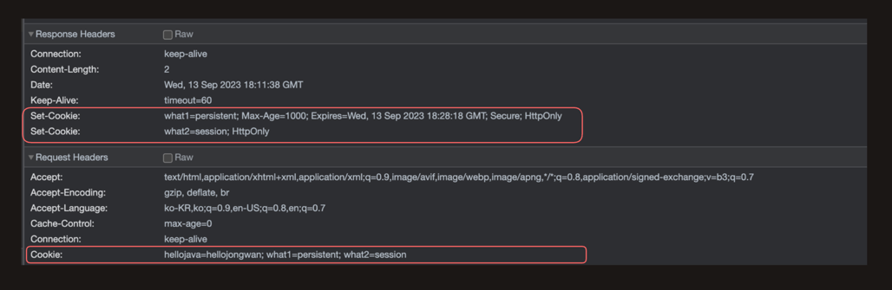

# Cookie And Session

## 쿠키란?
쿠키란 웹 서버가 생성하여 웹 브라우저로 전송하는 작은 정보 파일을 의미한다.
웹 브라우저는 수신한 쿠키를 설정에 여부에 따라 만료일 혹은 브라우저 종료시 까지 저장한다.

## 세션이란?
세션 역시 쿠키를 기반으로 한다. 쿠키는 정보를 웹 브라우저에 저장하지만, 세션은 정보를 서버에 저장하고 서버에 저장한 위치(sessionId)를 브라우저에서 쿠키로 관리한다.


## 쿠키와 세션을 사용하는 이유?

### http는 기본적으로 무상태 프로토콜이기 때문이다.

client와 server가 로그인을 하기 위해서 통신을 주고 받는 상황이다.
client는 id와 password를 post method를 통해서 server에 요청했고 server는 로그인이 성공했다고 응답했다.
하지만 http는 기본적으로 무상태 프로토콜이기 때문에 누가 어떤 요청을 했는지 알 수 없다. 즉 client가 전에 로그인을 했다는 사실을 알 수가 없다. 
로그인과 같이 `상태를 기억하고자 할 때` 사용하게 된다.

## 쿠키의 구성
### name
각각의 쿠키를 구별하는데 사용되는 이름이다. unique한 key값이기 때문에 구별하는데 사용된다.

### value
쿠키의 이름과 매핑되는 값

### maxAge
* 쿠키의 유지 시간을 의미한다.
* 쿠키를 삭제하고자 할 때에는 maxAge를 0 이하의 값을 주면 삭제할 수 있다.
* 쿠키는 유효시간을 갖고 있다. 쿠키의 유효 시간을 지정하지 않은 경우 웹 브라우저를 닫으면 쿠키는 자동으로 삭제되고 유효 시간을 지정할 경우 그 지정된 시간만큼 웹 브라우저를 닫더라도 유지된다.

### domain
* 쿠키를 전송할 도메인의 허용 범위를 나타낸다.
* 기본적으로 현재 서버의 도메인 및 최상위 도메인 까지만 domain을 설정할 수 있다. 즉, mail.naver.com이 현재 서버의 도메인이라고 한다면 naver.com까지 허용한다.
* 허용범위가 현재 서버의 도메인 만으로 정해진 이유는 보안적인 문제 때문이다. 내가 만든 cookie를 다른 관련 없는 서버에서 임의로 바꾼다면 보안에 구멍이날 확률이 메우 크다.

### path
* 쿠키를 전송할 요청 경로를 지정할 수 있다.
* http://localhost:8080/chap09/path2/viewCookies.jsp 라고 했을 때 `/chap09/path2/viewCookies.jsp` 이 부분을 나타낸다.
* 경로를 지정하게 되면, 지정한 경로를 포함한 하위 경로에만 쿠키를 전송할 수 있다. 
* 일반적으로 쿠키는 어떤 경로에서든 공통으로 사용되기 때문에 보통 "/"로 경로를 지정하게 된다.

---

## 세션 생성하기
session의 기본값은 true이다. 
그렇기 때문에 속성 값을 별도로 지정해 주지 않아도 세션이 생성된다. 일단 세션이 생성되고 나면 session 기본 객체를 통해서 세션을 사용할 수 있게 된다.

## 세션의 속성

```java
class Test {
	public static void main(String[] args) {
		// ...
        session.setAttribute("MEMBER_ID", "madvirus"); // 세션에 속성을 추가한다.
        session.setAttribute("NAME", "Jongwan"); // 세션에 속성을 추가한다.
        session.getAttribute("NAME"); // 세션의 key값을 이용해서 조회한다.
      
        session.removeAttribute("NAME"); // 세션의 속성값을 지운다.
	}
}
```
위와 같이  session에 저장된 속성 값들에 CRUD가 가능하다.

## Session을 종료시키고 싶을 때 
```java
class Test {
	public static void main(String[] args) {
      session.invalidate(); // 세션을 종료한다. 
	}
}
```

invalidate() method를 통해 종료할 수 있다.


## 세션의 타임아웃

세션은 최근 접근 시간이라는 개념을 가지고 있다.
session의 기본 객체가 사용될 때마다 갱신된다.

```java
class Test {
	public static void main(String[] args) {
      session.getLastAccessedTime(); // 최근에 session 객체에 접근한 시간 조회
      session.setMaxInactiveInterval(60 * 60); // 세션의 타임아웃 시간을 지정할 경우(초 단위)
	}
}
```
세션은 마지막 접근 시간으로부터 일정 시간 이내에 다시 세션에 접근하지 않은 경우 자동으로 세션을 종료하는 기능을 가지고 있다.
세션 제한 시간이 30분이라고 가정했을 때,  30분이 지나면 자동으로 세션이 종료된다.


---
updated. 23.09.14

## Cookie는 기본적으로 Session Cookie와 Persistent Cookie로 나뉜다.

쿠키는 두 가지 타입으로 나뉜다. 세션 쿠키와 지속 쿠키이다.


```java


package servlet_test.servlet.basic.request;

import java.io.IOException;

import javax.servlet.ServletException;
import javax.servlet.annotation.WebServlet;
import javax.servlet.http.Cookie;
import javax.servlet.http.HttpServlet;
import javax.servlet.http.HttpServletRequest;
import javax.servlet.http.HttpServletResponse;

@WebServlet(name = "requestTest", urlPatterns = "/request-test")
public class RequestTestServlet extends HttpServlet {
	@Override
	protected void service(HttpServletRequest req, HttpServletResponse resp) throws ServletException, IOException {
		// Persistent Cookie
		Cookie persistentCookie = new Cookie("what1", "persistent");
		persistentCookie.setMaxAge(1000); // Persistent Cookie일 경우 MaxAge 반드시 설정
        persistentCookie.setHttpOnly(true);
        persistentCookie.setSecure(true); // https일 경우에만 쿠키를 전달하는 옵션
		resp.addCookie(persistentCookie);
		
		
		// Session Cookie(Session Cookie일 경우 setMaxAge 설정 X)
		Cookie sessionCookie = new Cookie("what2", "session");
		sessionCookie.setHttpOnly(true);
		resp.addCookie(sessionCookie);
		resp.getWriter().write("ok");
	}		
}

```

### Session Cookie
주의!) Session Cookie와 위에서 언급한 세션은 다르다.



* Session Cookie는 임시적으로 저장되는 쿠키를 의미한다.
* 개발자 도구 -> 애플리케이션 -> Cookie의 목록을 들여다 보면 
* Expires 컬럼에 Session이라고 적히는게 특징이다.
* Session Cookie는 메모리에 저장이된다.
* 브라우저를 끄는 순간 Session Cookie도 사라지게 된다.

### Persistent Cookie



* Persistent Cookie는 max-age만큼 살아있는 쿠키로, max-age가 만료가 되어야 사라지는 쿠키이다.
* 지속 쿠키는 메모리가 아닌 디스크에 저장이 된다.
  * Chrome Brower라고 가정했을 때 경로는 아래와 같다.
  * cd Library/Application\ Support/Google/Chrome/Default
---

## Cookie의 추가 특징



쿠키를 네트워크 탭에서 확인해 보면 
response header, request header에 자동으로 포함되어 있는 걸 확인할 수 있다.
이는 Http 규약에 명시되어져 있다.


## Reference

* [웹 사이트의 쿠키란?](https://www.cloudflare.com/ko-kr/learning/privacy/what-are-cookies/)


