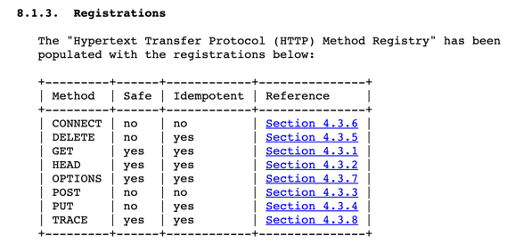

# 멱등성(Idempotent)

## 멱등성이란? 

[멱등성은 동일한 연산을 여러번 적용하더라도 결과가 달라지지 않는 성질을 의미한다.](https://ko.wikipedia.org/wiki/%EB%A9%B1%EB%93%B1%EB%B2%95%EC%B9%99)

아래의 예시 add method와 같이 numA와 numB에 1이라는 값을 넣으면 몇 번을 반복적으로 수행하더라도 동일한 반환 값 2를 반환한다.

```java
public class Calculator {
	
	// 동일한 A값과 B값을 parameter로 전달했을 때 항상 동일한 값을 반환하기 때문에 멱등한 메서드이다.
	private int add(final int numA, final int numB) {
		return numA + numB;
    }
}
```

## 멱등성은 왜 중요할까?
`멱등성은 동일한 요청을 2번 이상 시도하는 상황에서 데이터의 일관성을 보장해주기 때문에 굉장히 중요하다.`

한 예시로 회원가입을 들 수 있다. 한 유저가 이름, 비밀번호, 주소, 핸드폰 번호 등을 회원가입을 할때 작성을 해서 저장 버튼을 누르는 상황이다. 이 때, 작업을 처리 하느라 시간이 걸리거나 혹은 실수라도 
해당 버튼을 2번이상 누르는 경우는 꽤 많다. 클라이언트단 에서도 loading state관리를 통해 중복으로 누르는 경우를 최대한 방지할 수 있지만, 
멱등한 API라면 중복된 요청이 들어오더라도 항상 동일한 값을 리턴해주고, DB Server에 부하도 주지 않기 때문에 안정성, 신뢰성 모두 확보할 수 있다.


## 멱등성을 보장해주는 HTTP Method는 어떤 것들이 있을까?


[RFC 7231](https://www.rfc-editor.org/rfc/rfc7231#section-8.1.3)에서는 위와 같은 표를 제시한다. 

CONNECT, POST를 제외한 HTTP Method에 대해서 멱등성이 보장된다고 나와있다. (PATCH Method는 역시 기본적으로 멱등성을 보장하지 않는다고 말한다.)

## 그렇다면 POST, PATCH와 같은 Method들은 멱등성을 보장하지 않기 때문에 멱등하지 않게 구현하면 되는걸까?

아니다. 서버에서 POST METHOD에 대해 멱등하도록 구현하면 된다.
* 요청 헤더에 Idempotency-Key를 추가하자. (V4 UUID 권장)
* Time Out과 같이 응답을 받지 못한 경우에도 여러 번 요청이 가능하다.
* 이미 요청을 처리한 경우에는 기존에 내보냈던 응답을 반환한다. (그렇기 때문에 중복 요청에도 DB Server에 부하를 주지 않는다.)


## 멱등키는 어떤 level로 만들면 좋을까? User단위? 회사 단위? Method단위?..

아직 고민인 부분이다.


## Reference
* [MDN](https://developer.mozilla.org/ko/docs/Glossary/Idempotent)
* [멱등성이 뭔가요?](https://velog.io/@tosspayments/%EB%A9%B1%EB%93%B1%EC%84%B1%EC%9D%B4-%EB%AD%94%EA%B0%80%EC%9A%94)
* [API idempotency](https://docs.adyen.com/development-resources/api-idempotency/)