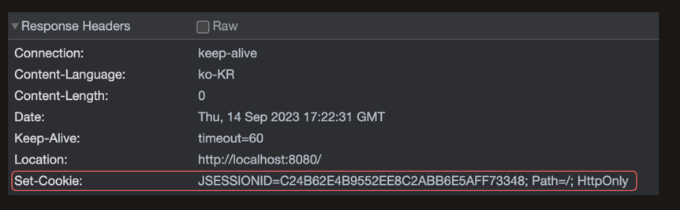

# Session 방식

## 생각해보기
쿠키와 세션에 대해서 공부하는 중에 이렇게 정의하는게 맞을까?(용어 자체에 대한 부분이다.)
쿠키와 세션은 결국 브라우저에 쿠키로 저장된다. 그래서 용어가 너무 헷갈린다. 애초에 세션 쿠키, 영속 쿠키와 같은 개념에서도 세션이란 용어가 사용된다. 
내가 생각했을 때 쿠키와 세션으로 용어를 정의하는 것은 헷갈림의 소지가 다분하다. 따라서, `쿠키 방식`과 `세션 방식`이라고 글에서는 표현하는게 맞는 것 같다.


## Session 방식이란?
Session 방식은 서버에 정보를 저장하고 저장한 위치(sessionId)를 웹 브러우저에 쿠키로 저장하는 방식을 의미한다.
세션 쿠키로 저장된 SessionId는 사용자 당 1개인 걸 명심하자.




## Session 직접 사용해 보기

### Session 생성하기 및 언제 생성 될까?
```java
public class SessionTestController {
	@GetMapping("/create-session")
	public String createSession(HttpServletRequest request) {
		// parameter가 true / sessionId가 존재할 경우 반환, 존재하지 않을 경우 생성해서 반환해준다.(default: true)
        HttpSession session1 = request.getSession(true);
				
        // parameter가 false /  sessionId가 존재할 경우 반환, 존재하지 않을 경우 null반환 
		HttpSession session2 = request.getSession(false);
		
		return null;
	}	
}

```

자바에서 HttpSession 클래스를 관리하는 주체는 Servlet Container이다. HttpSession은 생성하고 공간을 확보하는 것 자체도 비용이 들기 때문에 생성 시점을 
위에서 언급한 getSession() method를 통해서 호출했을 떄 생성되게 된다.

### Session attribute 저장하기 
```java
public  class SessionTestController {
	@GetMapping("/update-session")
	public String updateSession(HttpServletRequest request) {
		
		HttpSession session = request.getSession(true);
		System.out.println("session.getId() = " + session.getId());
		
		session.setAttribute("banana", 1);
		session.setAttribute("apple", 2);
		session.setAttribute("watermelon", 3);
		
		Enumeration<String> attributeNames = session.getAttributeNames();
		attributeNames.asIterator().forEachRemaining((v) -> System.out.println("v = " +  v + " " +  session.getAttribute(v)));
		return null;
	}
}
```
HttpSession에서 setAttribute() method를 통해 저장이 가능하다.

## Session은 언제 종료 될까?

1. 브라우저 종료 시점에 사라진다. 
2. HttpSession는 session 접근 시점 기준으로 지정한 시간 동안 유지되었다가 만료된다.(default: 30분) -> setMaxInactiveInterval() method혹은
   server.servlet.session.timeout=30 같이 글로벌에서 설정한 시간 만큼 유지되었다가 만료된다.
3. invalidate() method를 호출 했을 경우 사라진다. 


