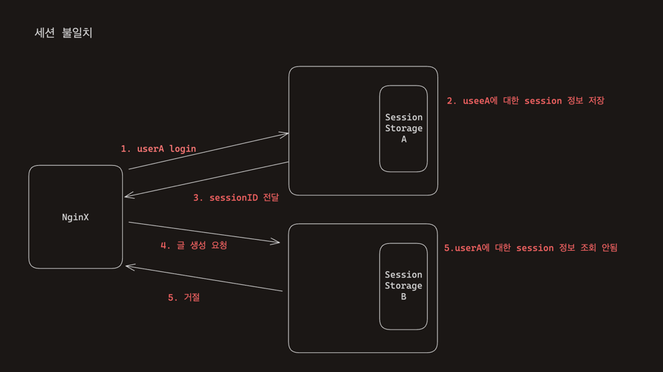
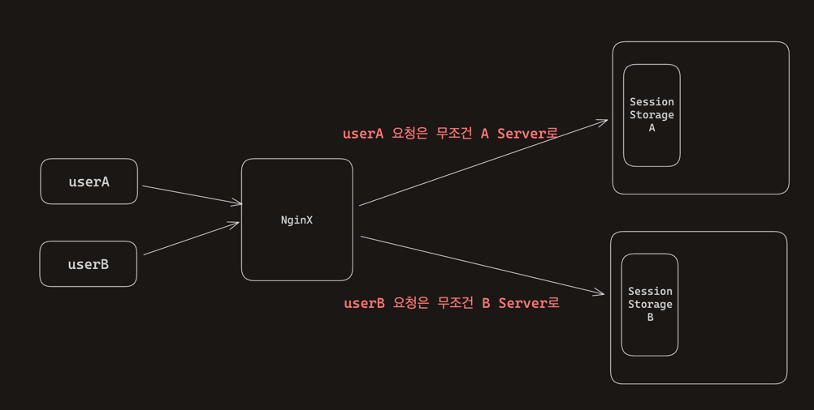
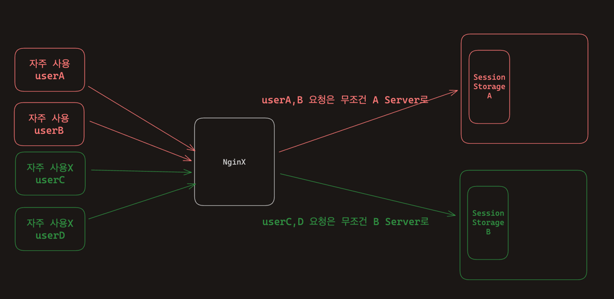
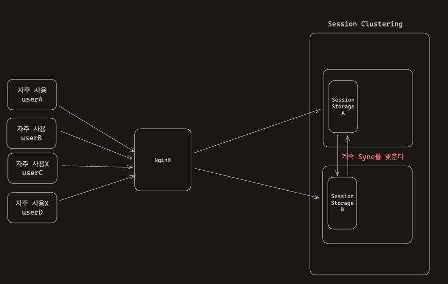
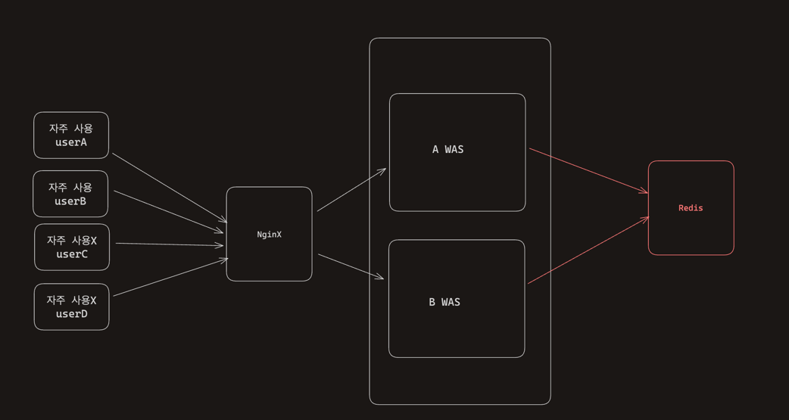

# Session Mismatch(세션 불일치)

## 세션 불일치란?

세션 불일치는 WAS가 2개 이상으로 scale out이 된 상황에서 발생하는데, 각 WAS 마다 독립적으로 세션을 관리하기 때문에 생기는 현상을 의미한다.

userA가 로그인 하는 상황을 가정해보자. Web Server인 NginX는 로드 밸런싱 역할도 함께 수행해주고 있다. 
userA가 로그인을 했을 때 A Server로 요청이 가면서 A Server의 Session Storag에 userA에 대한 정보가 저장되었다.
그리고 userA가 한 포스트에 좋아요를 누르려고 한다. 이때 좋아요 버튼에 대한 요청은 B Server로 향했다. SessionId 값으로 user에 대한 인가를 확인하려고 하는데
로그인을 했음에도 불구하고 B Server의 Session Storage안에는 userA에 대한 정보를 조회 할 수 없다. userA에 대한 정보는 A Server SessionStorage에 
저장 되어 있기 때문이다.

WAS가 2대 이상으로 scale out이 된 상황에서 각 WAS 마다 독립적으로 세션을 관리하기 때문에 Session Storage의 데이터가 불일치 하기 때문에 발생하는 현상을 
`세션 불일치`라고 한다.

## 세션 불일치 현상은 어떻게 해결할 수 있을까?

세션 불일치를 단순하게 바라보자.
세션 불일치는 왜 발생할까?

**SessionStorage의 데이터가 각 Storage마다 다르기 때문이다.**
그렇다면 해결 방법은, 각 Storage를 동기화 시키거나, 하나의 외부 Storage를 가지거나, 컴퓨터를 다시 한 대로 만들거나 등등이 떠오른다.
하나씩 살펴 보자.

### 1. 다시 WAS를 한대로 만든다.. 

정말 원초적인 방법이다. 사실 트래픽이 많아졌기 때문에 그것에 대한 해결 책으로 Scale Up이 아닌 Scale Out을 선택했을 것이다.
그런데 해결 방법으로 생각한 것은 정말 해결이 되기 때문이다. WAS Server 1개는 하나의 Storage를 가지기 때문에 세션 불일치 현상은 사라진다.

하지만, 해당 방법은 일시적인 상황에 대한 해결책일 뿐이다. 컴퓨터 한 대의 리소스는 한계가 있다. 그렇기 때문에 지금 당장은 해결되겠지만 
이벤트를 하게 되면 메모리가 쌓이고 쌓여 Out Of Memeory를 겪게 될 것이다. 그렇기 때문에 Scale Out을 하는게 옳다고 본다.

### 2. 사용자 마다 요청을 보내는 Server를 지정하면 어떨까? (Sticky Session)

한 번 요청이 들어온 사용자의 요청을 항상 동일한 Server로 보내는 것이다.
userA는 항상 A Server로만 요청을 보내고, userB는 항상 B Server로만 요청을 보내는 것이다.

현명하다고 생각할 수 있지만, 특정 서버로만 트래픽이 집중될 수 있다는 위험이 존재한다.

userA와 userB는 빈번하게 사용하는 유저인데 A Server로 지정이 되었고, userC와 userB는 로그인만 한 유저 인데 B Server로 지정되었다고 가정해 보자.
A Server에 2명의 요청이 아닌 만 건의 요청이 몰릴 수 있다. 이럴 때 해당 서버는 부하를 이기지 못하고 죽게 된다. 
그러면 해당 Server안에 저장 되어 있던 Session Storage의 정보 까지 복구 불가능하게 된다.

### 3. 그렇다면 각 Session Storage에 대해서 각 서버 마다 동일하게 싱크를 맞춘다면?(Session Clustering)

이렇게 되면 Sticky Session 방식에서 발생했던 분산 처리를 함에도 한 곳으로 몰릴 수 있는 위험과 하나의 서버가 죽었을 때 발생하는 Session Storage 정보의 유실 문제는 분명히 해결할 수 있다.
하지만, 불필요한 데이터가 각 Session Stroage에 쌓이게 되고, Session정보를 업데이트 할 때 마다 각 서버에 Session Stroage의 Sync를 맞추기 위해서
서로 통신을 진행할 텐데 이 부분에 대한 비용 역시 무시할 수 없다.

### 4. 외부에 통일된 Session Storage를 따로 가져간다면?

Redis와 같은 외부에 InMemory DB를 두는 것이다. 이렇게 했을 때 세션 불일치, 로드 밸런싱 관련 분산 처리 문제, 네트워크로 인한 싱크 비용
문제 들이 해결 된다. 하지만 문제가 없다고는 볼 수 없다. 
Redis가 트래픽을 견디지 못하고 죽게 된다면 이 또한 Session 데이터들을 유실할 수 있는 위험성이 존재한다.

## Reference

* [다중 서버 환경에서의 세션 불일치 문제와 해결방법](https://hudi.blog/session-consistency-issue/)
* [Redis를 이용하여 대용량 트래픽을 처리 가능한 세션 구조 만들기](https://j0free.tistory.com/2)

