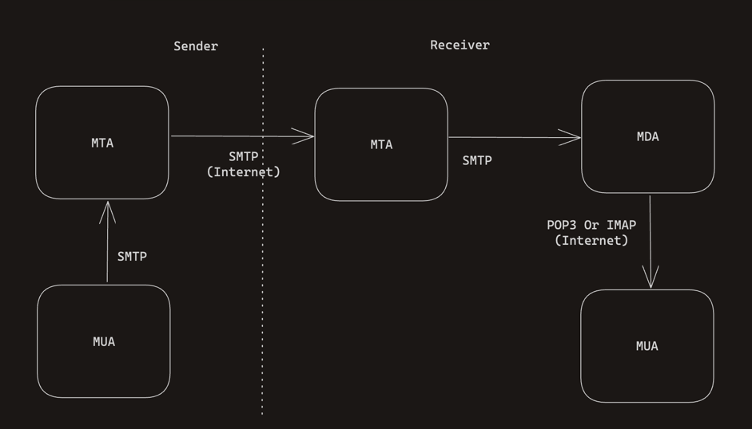

# SMTP

## SMTP란?

`Simple Mail Transfer Protocol`은 인터넷 상에서 이메일을 전송하는 데 사용되는 표준 프로토콜이다.
서로 다른 이메일 시스템 간의 메시지 전달 및 중계를 가능하게 해주며, TCP를 기반으로 동작한다.
일반적으로 SMTP는 25번 포트를 사용한다.

## 메일 전송에 관여하는 주요 구성 요소

### 메일 사용자 에이전트(MUA, Mail User Agent)
 
사용자의 이메일 클라이언트로, 메시지를 작성하고 받은 메일을 읽을 수 있다.

### 메일 전송 에이전트(MTA, Mail Transfer Agent)

메시지를 수신하고 전달하는 서버로, SMTP를 사용해 메시지를 전송한다.

### 메일 전달 에이전트(MDA, Mail Delivery Agent)

메시지를 최종 수신자의 메일박스에 전달하는 서버이다.

## SMTP 동작 원리

1. 발신자는 이메일을 작성한 후에 MTA에게 전달한다(SMTP 통신)
2. 발신자 MTA는 DNS를 통해서 IP주소를 확인하고 수신자 MTA에게 전달한다(SMTP 통신)
3. 수신자 MTA는 수신자 MDA에게 전달한다(SMTP 통신)
4. 수신자 MUA는 MDA로 부터 메일 내용을 확인한다(POP3/IMAP)

## POP3? IMAP?

이메일을 수신하고 동기화 하는데에는 POP3(Post Office Protocol 3)와 IMAP(Internet Message Access Protocol)이 사용된다.

### POP3
로컬에서만 이메일을 관리하는 프로토콜이기 때문에 다중 기기에서 동일한 메일을 확인하는데 제한이 있다.

### IMAP
서버에서 메시지를 관리하며, 클라이언트는 서버의 메시지를 동기화하여 볼 수 있다. 다중 기기에서 사용하기에 적합하며, 
서버에서 관리하기 때문에 수정, 삭제 관련해서도 실시간으로 반영된다.

## Reference

* [SMTP 기본 개념과 동작 원리](https://ccusean.tistory.com/entry/SMTP-%EA%B8%B0%EB%B3%B8-%EA%B0%9C%EB%85%90%EA%B3%BC-%EB%8F%99%EC%9E%91-%EC%9B%90%EB%A6%AC-%EC%9D%B4%EB%A9%94%EC%9D%BC-%EC%A0%84%EC%86%A1%EC%9D%98-%ED%95%B5%EC%8B%AC-%ED%94%84%EB%A1%9C%ED%86%A0%EC%BD%9C-%EC%95%8C%EC%95%84%EB%B3%B4%EA%B8%B0)