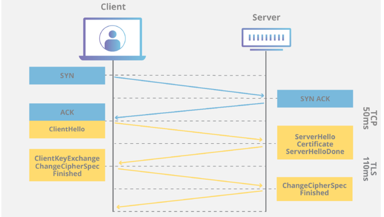
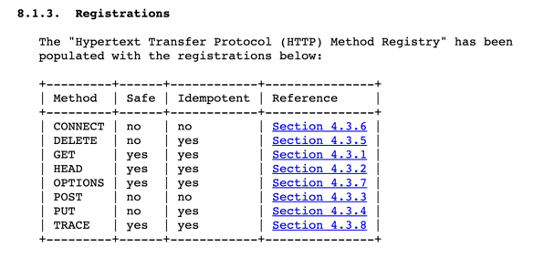
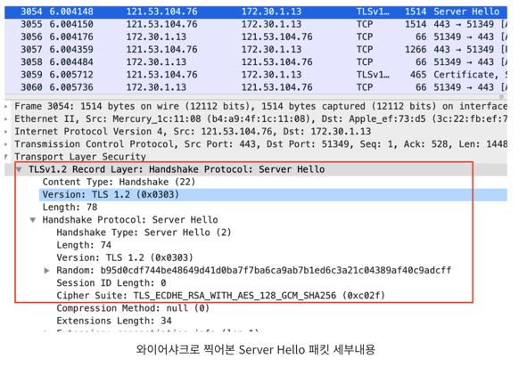
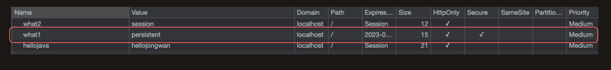

# SSL

## 대칭키란?
Client와 Server가 존재할 때  Client와 Server는 동일한 키(=대칭키)를 가지고 있어서 file or data를 
암호화 및 복호화가 둘 다 가능한 키를 대칭키라고 한다.
대칭키를 사용했을 때의 장점은 빠르게 암호화 및 복호화가 가능하다는 점이 있다. 반면에 대칭키를 사용했을 때 단점은 탈취를 당했을 때 바로 보안상의 위협으로 다가온다는 점을 들 수 있다.

## 비대칭키(=공개키)
비대칭 키는 A키를 이용해서 암호화를 한다면 B키를 이용해서만 복호화가 가능하고, B키를 이용해서 암호화를 한다면 A키를 이용해서만 복호화가 가능한 키를 말한다.
Server에서 private key를 보관하고 Client에는 비대칭키를 전달하여 탈취를 당해도 문제가 없는 공개키를 전달하게 된다. 그 이유는 복호화가 가능한 키는 private key뿐이기 때문이다.
탈취를 당하더라도 private key가 아니라면 안전하다는 장점이 있다. 하지만 그에 비해서 비대칭키를 사용하면 컴퓨터의 자원을 많이 사용하게 되어 느리다는 장점이 있다.

## SSL의 동작 방식은 어떻게 될까?

* [참고: TLS 핸드셰이크란 무엇일까요?](https://www.cloudflare.com/ko-kr/learning/ssl/what-happens-in-a-tls-handshake/)

0. 위의 이미지의 SYN, SYN ACK, ACK는 TCP의 3-way-handshake를 나타내는데, https는 tcp기반의 프로토콜이기 때문에 SSL HandShake 보다 먼저 연결된다. 

1. ClinetHello

* [참고: HTTPS 통신 원리 쉽게 이해하기 (Feat. SSL Handshake, SSL 인증서)](https://nuritech.tistory.com/25)

이때 Client는 보이지 않게 `ClientHello`를 Server에게 하게 된다. ClientHello를 통해서 서버측에 아래와 같은 내용을 전달하게 된다.
* **Random: 클라이언트 측에서 생성한 랜덤 데이터.**
* Cipher Suites: 내가 어떤 암호화 방식을 가지고 있는지에 대한 정보,   
* Session ID: 이미 HandShaking을 했었다면 세션 아이디를 제공한다.

2. ServerHello, Certificate

* [참고: ServerHello](https://nuritech.tistory.com/25)

* [참고: Certificate](https://nuritech.tistory.com/25)

이후에 요청을 받은 Server에서는 `ServerHello`와 `Certificate`를 하게 된다.  Server에서는 아래와 같은 정보를 Client에 전달 하게 된다.
* **Random: 서버 측에서 생성한 랜덤 데이터.**
* Cipher Suite: Client의 브라우저 환경에 맞게 선택한 암호화 방식 정보
* **인증서**
  * 인증서는 처음 CA에서 인증서를 발급 받을 때 비대칭키로 암호화가 되어있는 상태이다. 
  * 인증서 내부에는 signiture, 유효기간, 공개키 정보가 들어있다.

3. Client에서 Server로 부터 전달 받은 인증서를 검증한다.
Browser에는 따로 CA에 관한 정보(CA관련 정보 + 해당 인증기관의 공개키)들을 가지고 있다.
Server측에서 응답한 내용 중 인증서를 이용해 신뢰할 수 있는 인증서 인지를 판단 한다. 이떄 한 개라도(만료기간이 지난 인증서, 일치하지 않는 서명 등) 유효하지 않은 정보가 있을 시에는 신뢰할 수 없는 서버로 판단한다.

4. Client Key Exchange, Change Ciper Spec, Finished
인증서 검증이 완료되면 Client는 Server에게 대칭키를 전달한다.
이때 대칭키는 Client와 Server에서 1,2 단계에서 서로 공유한 Random 값을 공개키(복호화된 인증서의 공개키)로 암호화해서 서버측에 전달하게 된다.
전달하고 나면 Finished와 함께 Client는 통신 준비를 완료한다.

5. Change Ciper Spec, Finished

Client로 부터 암호화된 대칭키를 전달 받은 Server는 가지고 있는 private key를 이용해서 복호화 하게 된다.
이제 Client와 Server는 서로 동일한 대칭키를 가지게 되고 통신 준비를 완료하게 된다.

## Reference 
* [HTTPS와 SSL 인증서](https://opentutorials.org/course/228/4894)
* [HTTPS 통신 원리 쉽게 이해하기 (Feat. SSL Handshake, SSL 인증서)](https://nuritech.tistory.com/25)