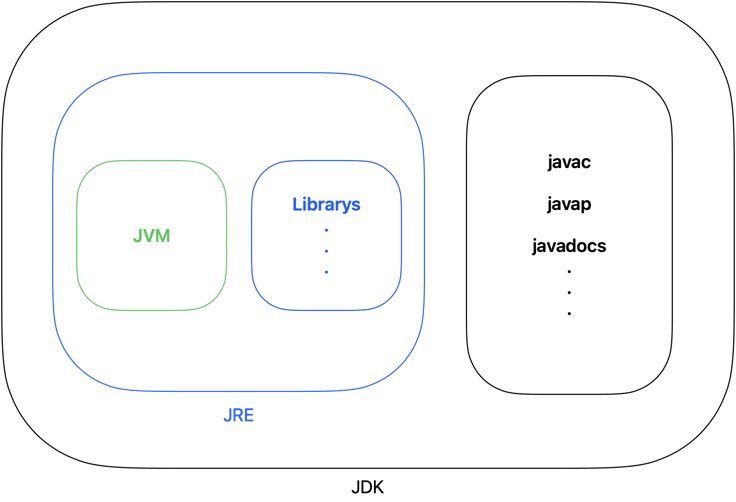
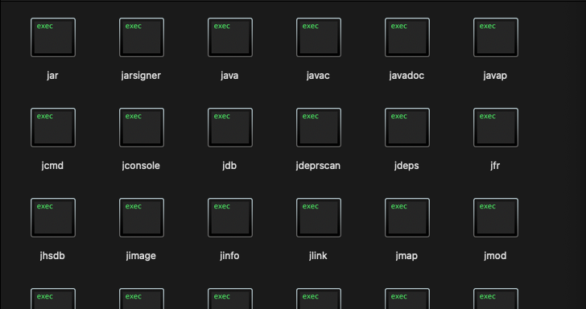
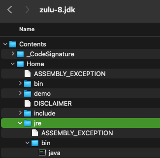

# Chapter02. 자바의 절차적/구조적 프로그래밍

## 들어가기 전에
이 장에서 물어보는 요소는 총 3가지 라고 판단이 든다🤔

1. JDK/JRE/JVM의 차이를 설명할 수 있는지.
2. main() method를 실행하면 내부적으로 프로그램은 어떻게 실행 되는지.
3. 프로그램의 메모리 구조와 코드를 한줄 한줄 실행할 떄, 내부 메모리에는 어떻게 저장 되는지.

## JDK/JRE/JVM의 차이



* JDK(Java Development Kit)
  * JVM용 소프트웨어 개발 도구
* JRE(Java Runtime Environment)
  * JVM용 OS
* JVM(Java Virtual Machine)
  * 가상 컴퓨터

* **자바 개발 도구인 JDK를 이용해 개발된 프로그램은 JRE에 의해 가상의 컴퓨터인 JVM 상에서 구동된다.**
* JDK는 자바 소스 컴파일러인 javac.exe를 포함하고 있다. JDK는 javac.exe 뿐만이아니라 정말 다양한 프로그램을 포함하고 있다.
* 


```shell
cd /Library/Java/JavaVirtualMachines/
```

경로로 들어간 이후에, home/content/bin으로 들어가면 `javac.exe` 프로그램이 보일 것이다! 

> 경로가 어디있는지 모르겠다면, 아래 명령어로 확인해보자.

```shell
sudo find / -name "jdk*"
```

* JRE는 자바 프로그램 실행기인 java.exe를 포함하고 있다.
Jdk17을 다운 받아서 살펴 보니, JDK17에서는 따로 JRE 폴더 구분 없이 java.exe 프로그램이 들어 있는걸 확인할 수 있다. JDK8에서는 확실히 jre 폴더 내부에 java.exe 프로그램을 확인할 수 있었다.




## 함수(Function)와 메서드(Method)의 차이

전혀 다르지 않다. 절차적/구조적 프로그래밍에서는 함수라고 불렀는데 객체 지향에서는 좀 다르게 불러야 하지 않을까? 그래서 메서드라고 불렀다고 한다.


## 아래의 프로그램은 어떻게 실행될까?

```java
public class Start {
	public static void main(Stirng[] args){
		System.out.println("Hello OOP!!");
    }
}
```

1. JRE는 먼저 프로그램 안에 main() method가 있는지를 확인한다.
2. main() method의 존재를 확인하면 JRE는 프로그램 실행을 위한 사전 준비를 시작한다.
3. 가상 머신인 JVM에 전원을 넣어 부팅한다.
4. 부팅된 JVM은 목적 파일을 받아 그 목적 파일을 실행한다.
5. 부팅이 완료된 JVM은 가장 먼저 java.lang 패키지를 T 메모리의 스태틱 영역에 가져다 놓는다.(그렇기 때문에 System.out.println() 같은 메서드를 사용이 가능하다.)
6. JVM은 개발자가 작성한 모든 클래스(?)와 임포트 패키지 역시 스태틱 영역에 가져다 놓는다.


## JVM은 정말 모든 클래스(?)를 import 해서 static 영역에 저장하는게 맞을까?

