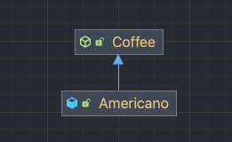
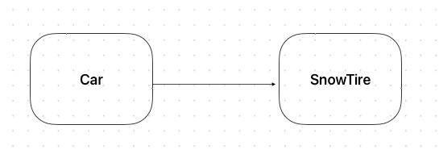
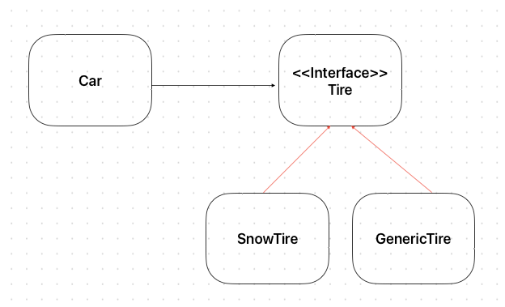

# Chapter.05 객체 지향 설계 5원칙 - SOLID


## LSP - Liscov Substitution Principle

리스코프 치환 원칙은 아래와 같이 말할 수 있다.

`하위 클래스의 인스턴스를 상위 클래스 타입의 참조 변수에 대입해 상위 클래스의 인스턴스 역할을 하는데 문제가 없어야 한다.`

객체 지향의 4가지 특성 중 '상속'은 아래의 특징을 만족해야하며, 계층도, 조직도가 아닌 분류도가 되어야 한다.

* 하위 클래스 is a kind of 상위 클래스
* 구현 클래스 is able to 인터페이스

위 두 문장대로 구현된 프로그램이라면 LSP를 잘 지키고 있다고 할 수 있다.


에시를 들어보자. 지금 커피를 마시고 있기 떄문에.. Coffee Class를 한 번 생성해보자.

```java
public class Coffee {
	private String name; // coffee 이름
	private int price; // coffee 가격
	private LocalDateTime createdAt; // 제조일자

	public Coffee(String name, int price, LocalDateTime createdAt) {
		this.name = name;
		this.price = price;
		this.createdAt = createdAt;
	}
	
	public abstract boolean isDrinkable(); // 마실 수 있는지 여부

	@Override
	public String toString() {
		return "Coffee{" +
			"name='" + name + '\'' +
			", price=" + price +
			", createdAt=" + createdAt +
			'}';
	}
	
}
```

그리고 Coffee Class를 확장한 Americano를 만들어보자! 

```java
public class Americano extends Coffee {
	private final static int PERIOD = 7;

	public Americano(String name, int price, LocalDateTime createdAt) {
		super(name, price, createdAt);
	}

	@Override
	public boolean isDrinkable() {
		return this.getCreatedAt().plusDays(PERIOD).isAfter(LocalDateTime.now());
	}
}
```

이렇게 했을 때 둘은 아래와 같은 분류도를 가질 수 있다.



```java
public class Driver {
	public static void main(String[] args) {
		// LSP를 잘 지킨 경우
        // 하위 클래스인 Americano의 인스턴스를 상위 클래 타입인 Coffee 참조 변수 americanoB에 대입하더라도 상위 클래스인 Coffee의 인스턴스 역할을 하는데
        // 문제가 없어야 한다.
		Coffee americanoA = new Americano("americanoB", 4500, LocalDateTime.now());
	}
}
```

위의 예시로 들었던 Coffee와 Americano의 관계는 LSP를 지켰을까?

* Americano is a kind of Coffee 말이 된다.
* 논리적으로 봤을 때도 문제가 없다. 커피 아메리카노A = new 아메리카노();

따라서 LSP 치환 원칙을 지켰다고 볼 수 있다.


## ISP - Interface Segregation Principle

SRP를 생각해본다면 하나의 클래스는 하나의 역할, 책임만을 가지고 있어야 한다. 그렇기 때문에 
여러개의 책임을 가지고 있는 클래스라고 한다면 여러 개의 클래스로 분리하자고 이야기한다.

분리하는 방법은 Class를 분리하는 방법도 있지만 인터페이스를 분리하는 방법도 존재한다.


책에서는 `남자`가 여러 역할을 가지고 있다는 예제로 설명한다.
여기서 남자는 남자친구, 아들, 사원, 소대원의 역할을 가지고 있다. 이걸 코드로 풀어보자.

```java
package com.example.flagstudy.solid.isp.before;

public interface Boy {
	// 남자 친구의 역할에서만 필요한 행위
	void 기념일챙기기();
	void 키스하기();

	// 아들의 역할에서만 필요한 행위
	void 효도하기();
	void 안마하기();

	// 사원의 역할에서만 필요한 행위
	void 출근하기();
	void 아부하기();

	// 소대원의 역할에서만 필요한 행위
	void 사격하기();
	void 구보하기();
}
```

이렇게 남자는 여러개의 역할을 가지고 있다. 그러면 내가 남자친구의 역할로 여자친구를 만난다고 해보자.

```java
package com.example.flagstudy.solid.isp.before;

public class BoyFriendImpl implements Boy {
	@Override
	public void 기념일챙기기() {
		System.out.println("기념일 챙기자~");
	}
	@Override
	public void 키스하기() {
		System.out.println("키스 하자~");
	}
	@Override
	public void 효도하기() {
		throw new RuntimeException("제 역할이 아닙니다~");
	}

	@Override
	public void 안마하기() {
		throw new RuntimeException("제 역할이 아닙니다~");
	}

	@Override
	public void 출근하기() {
		throw new RuntimeException("제 역할이 아닙니다~");
	}

	@Override
	public void 아부하기() {
		throw new RuntimeException("제 역할이 아닙니다~");
	}

	@Override
	public void 사격하기() {
		throw new RuntimeException("제 역할이 아닙니다~");
	}

	@Override
	public void 구보하기() {
		throw new RuntimeException("제 역할이 아닙니다~");
	}
}

```

결국 이렇게 남자친구의 역할에서 필요하지 않은 행위들 까지도 재정의를 해야하는 번거로움이 발생한다.
이 뜻은 필요하지 않은 기능을 구현해야한다는 비용이 발생한다는 뜻이다.
그러면 필요한 역할에 알맞게 인터페이스를 분리 해보자.

```java
package com.example.flagstudy.solid.isp;

public interface BoyFriend {
	void 기념일챙기기();

	void 키스하기();
}

```

```java
package com.example.flagstudy.solid.isp;

public class BoyFriendImpl implements BoyFriend {
	@Override
	public void 기념일챙기기() {
		System.out.println("기념일 챙기자~");
	}

	@Override
	public void 키스하기() {
		System.out.println("키스하자~");
	}
}
```

## DIP - Dependency Inversion Principle

의존 역전 원칙은, **하위 클래스가 아닌 최대한 변하지 않는 상위 클래스에 의존하라**는 원칙이다.

책에서는 예제를 자동차와 예시를 들었다. 
지금은 겨울이고 자동차 바퀴는 눈길을 오를 수 있는 바퀴로 장착했다.



이걸 코드로 구현해 보면,

```java
package com.example.flagstudy.solid.dip.before;

public class Car {
	private final SnowTire snowTire;
	public Car(SnowTire snowTire) {
		this.snowTire = snowTire;
	}
}

```
```java

package com.example.flagstudy.solid.dip.before;

import java.time.LocalDateTime;

public class SnowTire {
	private String color;
	private String madeIn;
	private LocalDateTime createdBy;
}

```

```java
package com.example.flagstudy.solid.dip.before;

public class Driver {
	public static void main(String[] args) {
		SnowTire snowTire = new SnowTire();
		Car car = new Car(snowTire);

	}
}
```

이렇게 Car는 SnowTire에 의존하고 있다. 그런데 겨울이 끝나고 봄이왔다. 이럴 경우에 일반 GenericTire로 변경을 해줘야 한다. 그럴 경우에 Car 클래스 자체를 수정헤 줘야한다.

```java
package com.example.flagstudy.solid.dip.before;

public class Car {
	
	private final GenericTire genericTire; // 변경된 부분 1
    // 변경된 parameter
	public Car(GenericTire genericTire) { 
		this.snowTire = snowTire;
	}
}
```
바퀴를 바꾸려고 했는데 자동차 클래스를 건드리게 된 것이다. 이 문제를 DIP 원칙을 적용해서 해결해보자. 그림은 아래와 같다.





먼저 Tire Interface를 만들자.

```java
public interface Tire {
}
```

그리고 Car Class 내부를 구체 클래스가 아닌 interface인 Tire를 의존하게 변경하자.

```java
package com.example.flagstudy.solid.dip.after;

public class Car {
	private final Tire tire;
	public Car(Tire tire) {
		this.tire = tire;
	}
}

```

```java
package com.example.flagstudy.solid.dip.after;

public class Driver {
	public static void main(String[] args) {
		Tire tire = new SnowTire();
		Car car = new Car(tire);
	}
}

```

DIP를 적용하고 난 이후에는, 운전자가 어떤 Tire로 변경을 하든 자동차는 Class를 수정할 필요가 없어진다 봄이 왔다? 하면 Driver Class에서만 변경해주면 된다. 

그리고 DIP를 적용 하기 전에는 SnowTire입장에서는 아무것도 의존 하지 않았었다. 그런데 DIP 원칙 적용 이후에는 Tire Interface를 의존하게 되었다.
의존이 역전이 된것이다!


